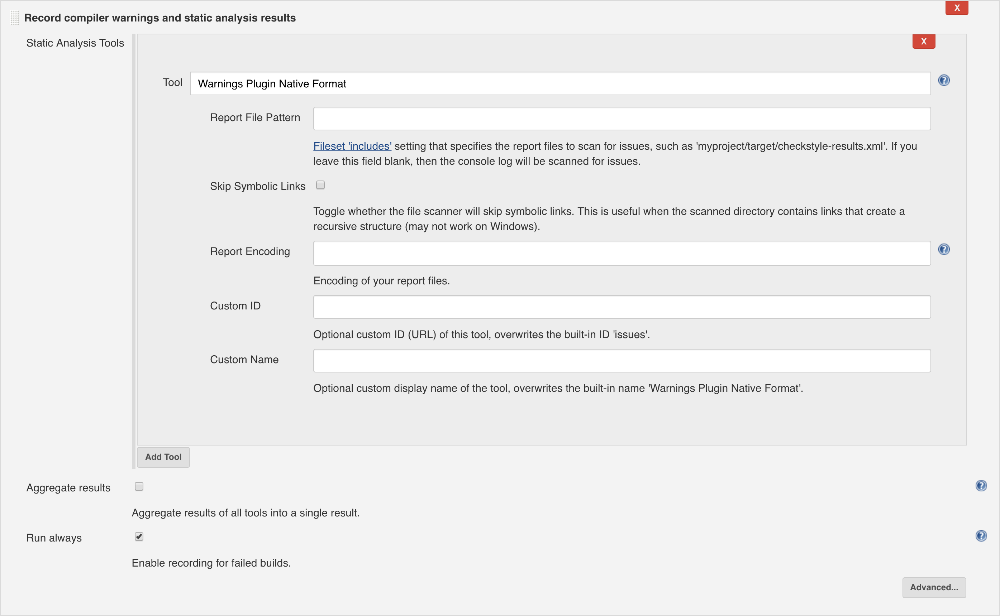

:rootdir: ../
:github-readme: {rootdir}/README.adoc
:srcdir: {rootdir}/src/
:listing-caption: Listing
:revdate: {project-builddate}
:revnumber: {project-version}

include::{github-readme}[tags=vardef]

:projectpage: https://github.com/{gh-repo-owner}/{gh-repo-name}

include::{github-readme}[tags=header]

== URLs

* link:{homepage}[Project home] (this page)
* link:{projectpage}[GitHub project]
* link:{issues}[Issue tracker]

TIP: Do you want to improve this page? Please git-link:self[edit it on GitHub, edit].

== Description

=== Background

Version `5.2.0` of the Jenkins plugin link:https://github.com/jenkinsci/warnings-ng-plugin["Warnings Next Generation"] supports different inputs with the "Warnings Plugin Native Format" tool.

If the file ends with `.xml`, the parser will read all `issue` nodes in the `report` root node:

[source, xml]
----
include::../issue-model/src/test/resources/report.xml[]
----

If the file ends with `.json`, a JSON array named `issues` is expected by the parser:

[source, json]
----
include::../issue-model/src/test/resources/report.json[]
----

A third solution is to have each issue serialised as JSON object on each text line.
This is interesting if you are creating a tool that gets a stream of issues and does not know when this will end.
In this case this tool can convert the single issues to one-liner JSON and append them to a text file.

[source, txt]
----
include::../issue-model/src/test/resources/log.txt[]
----

This project is about having the model classes that can be serialised as presented here, without any additional dependencies.

=== issue-model project

The project `fr.jmini.utils:issue-model` is only about model classes to represent the issues.
It has no additional dependencies, meaning that you will need to add in your project a serialisation library such as `com.google.code.gson:gson` to convert the object to JSON.

== Source Code

As for any grade based project, the source code is available in the `src/` folder of each module.

=== Build

This project is using gradle.

Command to build the sources locally:

----
./gradlew build
----

Command to deploy to your local maven repository:

----
./gradlew publishToMavenLocal
----

Command to build the documentation page:

----
./gradlew asciidoctor
----

The output of this command is an HTML page located at `<git repo root>/build/docs/html5/index.html`.

==== For project maintainers

`signing.gnupg.keyName` and `signing.gnupg.passphrase` are expected to be set in your local `gradle.properties` file to be able to sign.
`sonatypeUser` and `sonatypePassword` are expected to be set in order to be able to publish to a distant repository.
					
Command to build and publish the result to maven central:

----
./gradlew publishToNexus
----

Command to upload the documentation page on GitHub pages:

----
./gradlew gitPublishPush
----

Command to perform a release:

----
./gradlew release -Prelease.useAutomaticVersion=true
----

==== Using ssh-agent

Some tasks requires pushing into the distant git repository (release task or updating the `gh-pages` branch).
If they are failing with errors like this:
----
org.eclipse.jgit.api.errors.TransportException: ... Permission denied (publickey).
---- 

Then `ssh-agent` can be used.
----
eval `ssh-agent -s`
ssh-add ~/.ssh/id_rsa
----
(link:https://superuser.com/a/990447/[source] for this approach)

include::{github-readme}[tags=contact-section]

include::{github-readme}[tags=license-section]

